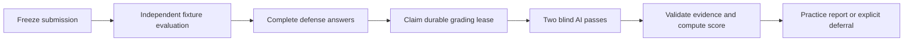

# Automated AI practice grading: research, implementation and deployment

Research date: October 8, 2026. Rubric: `v4-research-pilot`. Automated prompt: `automated-rubric-v1`.

## Decision

Use a hybrid assessor: independently executed behavioral checks establish observable correctness; an AI judge evaluates submitted source, recorded workflow and defense answers against explicit anchored criteria. Two blind passes check consistency. Server code validates citations, applies correctness limits and computes scores. Unsupported judgments produce an explicit deferral, never an invented zero.

This is an automated **practice assessment**. Research does not establish that this model, these weights or this workflow accurately predicts hiring performance. Two calls to the same model are not a diverse jury and can share the same errors. The implementation is a bounded production pilot, not a claim of optimality.

## Research scope and reading depth

This extends the earlier role/rubric review in `ai-enabled-swe-rubric-research-2026-10.md`. Sources below were selected for software assessment, structured judging, bias, adversarial robustness and operational design. The software-engineering study and MT-Bench paper were examined in selected HTML methods/results sections; other papers were screened through primary abstracts unless noted. Provider API documentation was inspected directly. This is a targeted review, not a claim to have read every related paper or every full text. Findings from text-generation evaluations are adjacent evidence, not direct validation of candidate assessment.

| Primary source | Finding relevant to design | Application and limit |
|---|---|---|
| [Can LLMs Replace Human Evaluators? ISSTA 2025](https://arxiv.org/abs/2502.06193) | Judging method and task materially affect alignment with human evaluations across code generation, translation and summarization. Direct output-based judging performed well in the studied settings. | Score one attempt against anchored criteria; retain task-specific evidence. Reported correlations are not candidate-grading accuracy and do not validate our chosen provider. |
| [G-Eval, EMNLP 2023](https://arxiv.org/abs/2303.16634) | Structured criteria and form-filling evaluation can improve alignment for natural-language generation. | Explicit dimensions, structured ratings and short evidence rationales; no request for private chain-of-thought. NLG results do not establish SWE rubric validity. |
| [Judging LLM-as-a-Judge with MT-Bench and Chatbot Arena](https://arxiv.org/html/2306.05685v4) | Judges exhibit position, verbosity and self-preference biases. | No rewards for long answers, tool brands or prompt volume. Second pass reverses rubric/evidence order; this is a diagnostic, not elimination of bias. |
| [Large Language Models are not Fair Evaluators, ACL 2024](https://arxiv.org/abs/2305.17926) | Ordering can affect comparative judgments. | Avoid ranking candidates against one another. Independently assess the same evidence in each pass and surface disagreement. |
| [Replacing Judges with Juries](https://arxiv.org/abs/2404.18796) | Diverse model panels reduced intramodel bias and improved results in the evaluated datasets. | Future cross-family judge selection should be benchmarked locally. Current two DeepSeek calls check consistency only; they do not provide model diversity. |
| [CheckEval, EMNLP 2025](https://aclanthology.org/2025.emnlp-main.796/) | Decomposing criteria into checklists can improve reliability in text-generation evaluation. | Keep dimensions distinct, provide five explicit anchors and require evidence for every assigned score. This implementation does not reproduce the paper's binary-checklist framework. |
| [Survey of Programming Assignment Grading with LLMs, 2025 preprint](https://arxiv.org/abs/2509.26483) | Agreement among models can coexist with weaker agreement with human grading. | Consensus is insufficient validation; practice labels remain explicit and human calibration remains necessary. |
| [Rubric-Conditioned Grading, 2026 preprint](https://arxiv.org/abs/2601.08843) | Rubric detail and consensus/deferral choices affect accuracy and coverage. | Preserve the existing rubric rather than adding speculative subcriteria. Missing evidence or material disagreement withholds the overall score. Deferral rate must be measured. |
| [GradeHITL, 2025 preprint](https://arxiv.org/abs/2504.05239) | Expert input can support refinement of grading rubrics. | Periodic expert audits are a development requirement before stronger claims; they need not block every practice session. |
| [RobustJudge, 2025 preprint](https://arxiv.org/abs/2506.09443) | Judge robustness depends on attacks, prompting and model choice. | Test malicious candidate content and semantic perturbations; do not treat valid JSON or consensus as robustness proof. |
| [Judge vulnerability study, 2025 preprint](https://arxiv.org/abs/2505.13348) | Adversarial inputs can alter judgments in studied judge settings. | Candidate code, comments, transcripts and answers are untrusted data. Judges have no tools or execution access. Attack findings are not universal rates. |
| [Adversarial Attacks on LLM-as-a-Judge, 2025 preprint](https://arxiv.org/abs/2504.18333) | Answer-side attacks threaten evaluation reliability. | Exact evidence citation validation, fixed rubric, immutable source and server-computed scores constrain the attack surface; semantic manipulation remains possible. |
| [Automating Autograding, 2024/2025](https://arxiv.org/abs/2411.09261) | Generated tests can expand assessment coverage and expose ambiguity. | Independent fixture execution remains the behavioral oracle. Candidate-written tests are evidence, not an independent correctness certificate. |
| [IBM ICPC 2025 source-code grading study](https://research.ibm.com/publications/ai-based-automated-grading-of-source-code-of-introductory-programming-assignments) | Rubric-based code grading is an adjacent application. | Useful design precedent; introductory assignments differ from repository repair and AI workflow ownership. |
| [Construct validity of LLM judges, 2026 preprint](https://arxiv.org/abs/2608.24419) | Invariance to irrelevant style and sensitivity to meaningful changes are separate evaluation goals. | Calibration must include terse correct work, polished incorrect work and controlled semantic changes, not just repeated identical requests. |
| [DeepSeek Chat Completions API](https://api-docs.deepseek.com/api/create-chat-completion/) and [JSON mode](https://api-docs.deepseek.com/guides/json_mode/) | JSON output mode does not prove correctness or adherence to our schema; truncation and empty outputs need handling. | Strict local schema validation, exact dimension sets, quote checks, output bounds and stop-reason checks. Use the existing provider integration and credentials. |

## What is graded

The approved six dimensions retain their weights: functional correctness 30%, framing/investigation 15%, fix quality 15%, AI judgment 10%, verification 20%, explanation/ownership 10%. Each has five explicit anchors, 0–4. Research supports anchored, evidence-driven evaluation; it does not mathematically determine these percentages.

The model receives the public task contract and reviewed required-part guidance, frozen source, eligible logged events, in-session AI interactions when observed, required defense answers, and verified behavioral outcome summaries. Hidden fixture code, fixture inputs, expected answers and private grading error details are excluded. Lockfiles are excluded from the source context; required behavior still uses the complete independently evaluated snapshot.

A non-null score requires an exact quoted substring from a known evidence ID. Correctness must cite independently verified evaluation; fix quality must cite source; AI judgment must cite an observed AI interaction; ownership must cite a candidate statement. Quotes prove provenance, not that the model interpreted them correctly. Missing evidence is null. Optional part 4 is not graded. When AI use is not observed, its dimension is not applicable and the denominator is adjusted with a comparison warning.

Two passes receive the same evidence but no earlier judgment. The audit pass reverses presentation order. Differences exceeding one anchor, missing required dimensions or declared material uncertainty withhold the overall score. Supported dimension feedback may still be displayed. Within one anchor, the server averages ratings, so half-anchor scores are possible. This one-anchor threshold is an engineering pilot policy, not a research-established optimum.

Server correctness limits override both judges: zero verified behavior caps correctness at zero; any failed behavior or unexecuted manual requirement caps it at two. The independent behavioral percentage remains visible separately. A high aggregate cannot erase failed requirements. A score of four requires relevant evidence beyond basic success, subject to judge interpretation.

## Execution and deployment

The existing Modal scheduler drains the independent evaluation queue and then the AI queue. JSON state in existing evaluation records provides durable queue status, lease tokens, retry timestamps and bounded audit history. No new database schema, queue vendor or browser-side secret is required. The lease expires after 360 seconds; no source/review locks remain held during provider requests. Final publication rechecks the lease token and evidence packet digest. Revising defense answers invalidates the old outcome and discards any in-flight stale result.

Automatic attempts are bounded at two. A provider failure retries after at least 60 seconds, then defers. One candidate-requested retry is allowed after deferral, with ownership and rate controls. Grading starts only after required defense answers are complete; the report explains this dependency and polls queued/running work. Every supported task uses the same central rubric and worker, including all 25 currently registered tasks.

Private audit records retain both structured judgments, provider/model metadata, response digests, the full input digest, per-evidence content digests and the defense snapshot. Candidate responses expose a narrow practice projection, not raw judgments, private evidence bodies, lease tokens or grading source details. Human-reviewed published ratings retain priority and their existing calibration/publication gates remain intact.

Production uses the existing DeepSeek provider, configured model `deepseek-flash`, temperature zero, non-thinking JSON mode, a 100,000-byte input bound and a 3,200-token output bound per call. The worker makes two separate calls. Temperature zero does not guarantee identical output. Large evidence bundles defer instead of silently truncating candidate work. The AI kill switch applies before calls. Shared global/user spending ceilings remain; grading has a separate session allowance so it does not consume the candidate chat session allowance. Reservations occur before each call and are not refunded after possibly billed failures. Actual cost depends on provider usage and current prices; no fixed per-grade cost is asserted here.

Deploy the backend from an isolated export containing only grading changes, then verify feature enablement, credential availability, live provider schema compatibility, scheduler deployment and candidate report behavior. Frontend deploys through the existing Vercel integration. Rollback disables `PROMPTCODE_GRADING_AUTO_ENABLED` or redeploys the prior backend; completed audit records remain. A backend code deployment alone does not establish that a candidate has received a grade: a live end-to-end submission check is distinct from a provider smoke test.

## Verification and calibration

Focused tests cover strict schemas, forged evidence, boolean ratings, optional AI, half anchors, disagreements, missing evidence, correctness caps, manual coverage, provider bounds, separate grading budgets with shared global ceilings, private projection, completed defense, successful workflow, bounded provider retries, active leases and stale defense revisions. Frontend tests cover explicit AI labels, half anchors, separate behavioral checks, pending statuses and deferral without zero grades. Broader existing integration tests establish regression coverage, not human grading accuracy.

Before using ratings beyond practice, build a consented expert-labeled corpus stratified across task families and evidence completeness. Include correct repairs with concise explanations, polished but incorrect repairs, partially correct repairs, copied solutions without ownership evidence, unavailable AI, external AI not observed, flaky checks, manual UI requirements and embedded grading instructions. Have two qualified reviewers label independently and adjudicate discrepancies. Keep held-out cases separate from prompt development.

Measure per-dimension weighted agreement with reviewers, mean absolute error, behavioral failure false-positive rates, overall and subgroup deferral rates, citation rejection rates, repeatability, latency, usage and cost. Test style-only perturbations separately from semantic changes. Select models and thresholds on development cases, report held-out uncertainty intervals, and rerun after model/prompt/rubric/task changes. Do not infer protected traits from submissions. No such local calibration corpus or human agreement result is claimed for this release.

Operational follow-up: monitor queued age, expired leases, retries, provider/schema failures, budget denials, disagreement and manual-coverage flags through persisted states; add alerting and a reviewed dashboard when volume warrants it. Diverse-provider judging, calibrated thresholds, workload scaling and stronger adversarial evaluation remain justified next improvements. None should be presented as already implemented.

## Release verification receipt

Implementation commit: `542bb0c`, integrated with concurrent published website changes. Modal backend and its existing scheduled grading function deployed successfully; Vercel reported a successful deployment.

- Isolated implementation regression suite: **1,091 passed, 180 skipped**. Skips remain visible and are not claimed as exercised coverage.
- After integrating concurrent commits: **74 targeted backend tests passed**, repository backend lint passed, and the configured strict type check passed for 29 source files.
- **29 integrated frontend tests passed**, including automatic grading rendering and concurrent navigation/cache behavior. The initial isolated frontend run also passed 42 tests.
- Real provider smoke check: two DeepSeek passes returned strict, citation-validated five-dimension output for synthetic non-AI evidence. The first probe revealed an extra JSON key; the prompt was clarified and the strict validator was retained.
- Live website audit: all **25** registered challenges advertised automated grading and the current rubric; the updated report asset was present.
- Live end-to-end QA account: a minimal `order-hold-reason` repair passed seven visible tests, completed all four defense answers, was independently evaluated, and received an **automated_practice** report with **75/100** overall and **100%** behavioral checks. Unobserved AI judgment was not applicable. Private automatic grading state was absent from the candidate response. This session is explicitly identified as deployment QA, not real candidate performance.

These checks demonstrate operation of the pipeline, not psychometric validity, provider superiority or accuracy across every task family. CI status is reported separately; a local pass is not a substitute for a completed hosted check. A versioned report asset prevents existing browser caching from retaining the prior grading UI after navigation to refreshed markup.
